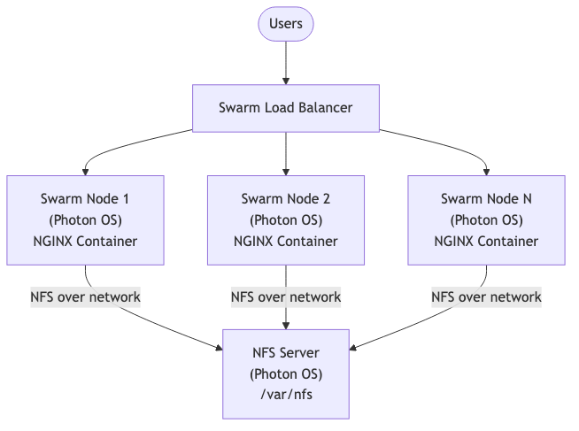
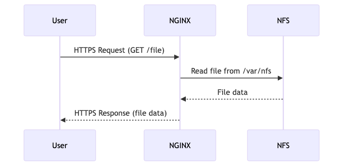

# nginx-nfs Docker Image

This project provides a minimal Docker image for NGINX, designed for use in environments where NGINX serves content from an NFS-mounted directory. It is ideal for Docker Swarm or Kubernetes setups where persistent, shared storage is required.

## Project Purpose

The main goal is to provide a lightweight, production-ready NGINX image that can be used as a stateless frontend, with content (such as static websites or assets) stored on a shared NFS volume. This is useful for high-availability and scalable deployments.

### Included Files
- `Dockerfile`: Builds the image from `nginx:alpine` and copies in your custom `nginx.conf`.
- `nginx.conf`: Your NGINX configuration (must be present in this directory). Configure root, server blocks, and NFS mount points as needed.
- `build.sh`: Builds the image for the `amd64` platform using Docker Buildx, ensuring compatibility with most server hardware.
- `push-image.sh`: Builds and pushes the image to a Docker registry. Accepts registry URL and optional tag as arguments.
- `.dockerignore`: Excludes unnecessary files from the build context, reducing image size and build time.

### Prerequisites
- Docker with Buildx enabled (for cross-platform builds)
- Access to a Docker registry (if you want to push images)
- A valid `nginx.conf` file in the project directory

### Usage

#### 1. Build the Image (amd64)
```sh
./build.sh
```

#### 2. Push the Image to a Registry
```sh
./push-image.sh <registry_url> [image_tag]
# Example:
./push-image.sh registry.example.com/username/nginx-nfs v1.0
```

#### 3. Build and Push Manually
```sh
# Build for amd64 and push
docker buildx build --platform linux/amd64 -t <registry_url>:<tag> . --push
```

### Configuration
- **nginx.conf**: This file controls how NGINX serves static content. The image expects your static files (HTML, CSS, JS, etc.) to be available at `/usr/share/nginx/html` inside the container. This path should be mounted from your NFS server.
	- Example root directive in `nginx.conf`:
		```nginx
		server {
				listen 80;
				server_name _;
				root /var/nfs/nginx/html;
				index index.html;
				location / {
						try_files $uri $uri/ =404;
				}
		}
		```
	- On your NFS server, the exported directory (e.g., `/srv/nfs` or `/var/nfs`) should contain the static files you want to serve. In your Docker Compose or Swarm stack, mount this NFS export to `/usr/share/nginx/html` in the container.
- **NFS Volume**: Ensure your NFS server is accessible from all nodes running the container, and the exported directory contains your website or static assets.
- **Permissions**: The NGINX user inside the container must have read access to the NFS share.

## Architecture Diagram

Below is the high-level architecture for the NGINX + NFS Docker Swarm setup, rendered as a Mermaid diagram:



---

## NGINX HTTPS Flow



## Example Docker Compose/Swarm Service
```yaml
services:
	nginx:
		image: <registry_url>:<tag>
		volumes:
			- nfsdata:/usr/share/nginx/html:ro
		networks:
			- traefik-net
		deploy:
			replicas: 3
			labels:
				- "traefik.enable=true"
				- "traefik.http.routers.nginx.rule=Host(`example.com`)"
				- "traefik.http.services.nginx.loadbalancer.server.port=80"
volumes:
	nfsdata:
		driver: local
		driver_opts:
			type: "nfs"
			o: "addr=192.168.1.100,nolock,soft,rw"
			device: ":/srv/nfs"
networks:
	traefik-net:
		external: true
```


## Troubleshooting
- If the build fails, check that `nginx.conf` is present and valid.
- If NGINX cannot serve files, verify the NFS mount is working and permissions are correct.
- Use `docker logs <container>` to view NGINX error logs.
- For cross-platform issues, ensure you are building with the correct platform flag (`--platform linux/amd64`).

## Environment Variables and Configuration Options

You can customize the behavior of your NGINX containers and stack using environment variables and configuration options. Common examples include:

- **NGINX Environment Variables:**
	- `NGINX_PORT`: Set the port NGINX listens on (default: 80). Example:
		```yaml
		environment:
			- NGINX_PORT=8080
		```
	- `NGINX_WORKER_PROCESSES`: Number of worker processes (overrides nginx.conf if set).
	- `NGINX_WORKER_CONNECTIONS`: Number of worker connections (overrides nginx.conf if set).

- **Custom Variables in docker-compose.yml or Swarm Stack:**
	- `TZ`: Set the timezone for logs and processes.
	- `VIRTUAL_HOST`, `LETSENCRYPT_HOST`, `LETSENCRYPT_EMAIL`: Used by reverse proxies like Traefik or nginx-proxy for dynamic routing and SSL.

- **NFS Mount Options:**
	- `type`, `o`, `device`: Set in the `volumes` section to control NFS mount behavior (see example in Usage section).

- **Secrets and Certificates:**
	- Use Docker secrets or bind mounts to provide SSL certificates, keys, or sensitive config files securely.

Refer to your orchestrator’s documentation and the official NGINX image docs for more environment variables and configuration options.

## Testing and Validation

After deploying your stack, it’s important to verify that everything is working as expected:

- **Basic Connectivity:**
	- Access the NGINX service via its public URL or IP and ensure you receive the expected content.
	- Use `curl` or a web browser to test endpoints:
		```sh
		curl -v http://<nginx-service-url>/
		```

- **NFS Mount Validation:**
	- Enter a running NGINX container and check that the NFS mount is present and files are accessible:
		```sh
		docker exec -it <nginx-container> sh
		ls /usr/share/nginx/html
		```

- **Health Checks:**
	- Ensure health checks are passing in your orchestrator (Swarm/Kubernetes).
	- Check NGINX status endpoints if configured.

- **Log Review:**
	- Review NGINX access and error logs for unexpected issues:
		```sh
		docker logs <nginx-container>
		```

- **Backup/Restore Test:**
	- Perform a test backup and restore cycle to ensure data integrity.

- **Automated Testing:**
	- Consider adding integration tests or monitoring scripts to validate service availability and content delivery.

## Operational Tips

- **Scaling:**
	- Use Docker Swarm or Kubernetes to scale NGINX replicas up or down based on load.
	- Ensure all nodes have access to the NFS share and proper permissions.

- **Zero-Downtime Updates:**
	- Use rolling updates in Swarm or Kubernetes to update containers without downtime.
	- Test new images in a staging environment before deploying to production.

- **Health Checks:**
	- Configure health checks in your orchestrator to automatically restart unhealthy containers.
	- Use NGINX’s built-in status module or a custom health endpoint.

- **Monitoring & Logging:**
	- Aggregate NGINX logs using a centralized logging solution (e.g., ELK, Loki, or similar).
	- Monitor NFS server performance and disk usage.

- **Troubleshooting:**
	- Use `docker logs <container>` to view NGINX errors and access logs.
	- Check NFS mount status with `mount | grep nfs` and ensure network connectivity.
	- Validate permissions on the NFS share if files are not being served.

- **Disaster Recovery:**
	- Regularly test your backup and restore process.
	- Document recovery steps and keep them accessible to your team.

## Security Considerations

Security is critical when exposing NGINX and NFS in production environments. Below are some best practices:

### NGINX
- Always use HTTPS for client connections. Terminate SSL at NGINX and use strong ciphers.
- Regularly update the NGINX image to include the latest security patches.
- Limit allowed HTTP methods and restrict access to sensitive locations in your `nginx.conf`.
- Use security headers (e.g., `Strict-Transport-Security`, `X-Frame-Options`, `X-Content-Type-Options`).
- Consider running NGINX as a non-root user if possible.

### NFS
- Restrict NFS exports to only trusted client IPs in your `/etc/exports` file.
- Use firewalls to limit access to NFS ports (typically 2049/tcp and related ports).
- Avoid exporting NFS shares with `no_root_squash` unless absolutely necessary.
- Monitor and log NFS access for unusual activity.

### General
- Store secrets (such as passwords or certificates) securely, using Docker secrets or environment variables, not in source code.
- Regularly back up your NFS data and test restores.
- Keep your OS and all dependencies up to date.
- Use network segmentation to isolate critical services.

For more information, consult the [NGINX Security Guide](https://docs.nginx.com/nginx/admin-guide/security-controls/) and your operating system’s security best practices.

---
### References
- [NGINX Official Documentation](https://nginx.org/en/docs/)
- [Docker Buildx](https://docs.docker.com/buildx/working-with-buildx/)
- [Docker Compose File Reference](https://docs.docker.com/compose/compose-file/)
- [NFS on Docker](https://docs.docker.com/storage/volumes/#nfs)

---

> **Note:** Diagrams above are provided as code blocks for clarity and can be exported as images for better rendering on GitHub or other platforms.

---
For questions, improvements, or issues, please open an issue or pull request.
